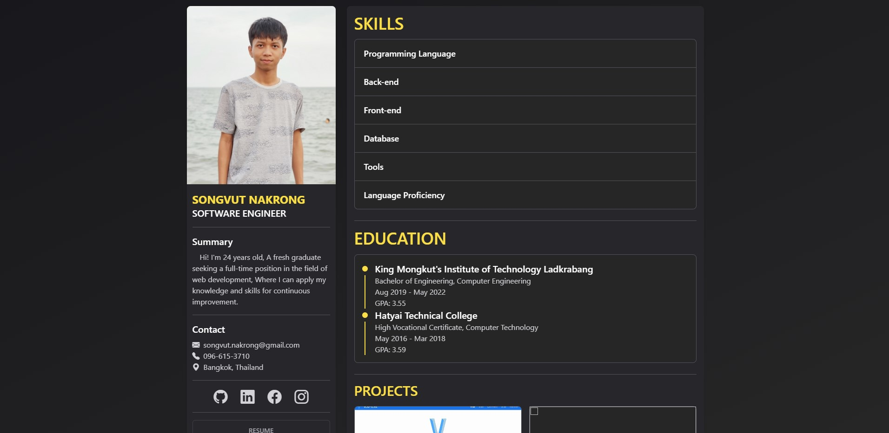

# Songvut - Website

## Screenshot

## Run Development Mode

In the project directory, you can run:

`npm run dev`

Open [http://localhost:3000](http://localhost:3000) to view it in your browser.

## Run Build Mode

Builds the app for production to the build folder.

`npm run build`

`npm run preview` or `npx serve -s dist`

Open [http://localhost:3000](http://localhost:3000) to view build mode it in your browser.

## Learn More

- [React](https://reactjs.org/)
- [Tailwind CSS](https://tailwindcss.com/)
- [Bootstrap Icons](https://icons.getbootstrap.com/)
- [Vite](https://vitejs.dev/)
- [Firebase Hosting](https://firebase.google.com/docs/hosting)
